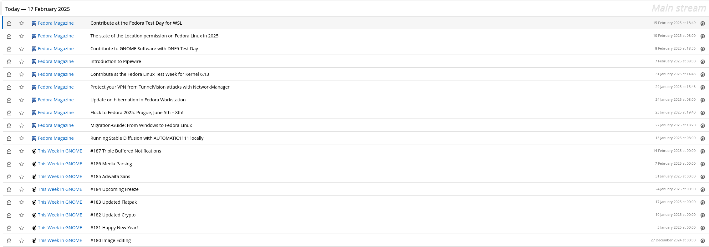

# Self Hosted FreshRSS server

This playbook allows you to self-host a FreshRSS sever with podman containers and systemd Quadlets.

It was tested on Fedora 41.

References:
- https://github.com/FreshRSS/FreshRSS/tree/edge
- https://github.com/FreshRSS/FreshRSS/tree/edge/Docker