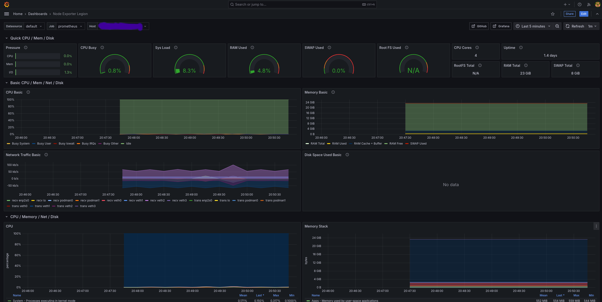

# Node Exporter

This playbook allows you to install and run the prometheus node exporter in Podman.

Using the node exporter allows export metrics from your server, have a Prometheus server scrape them and
create beautiful dashboard in Grafana.

It was tested on Fedora 41 & Fedora Server.

References:

- https://grafana.com/grafana/dashboards/1860-node-exporter-full/
- https://hub.docker.com/r/bitnami/prometheus
- 