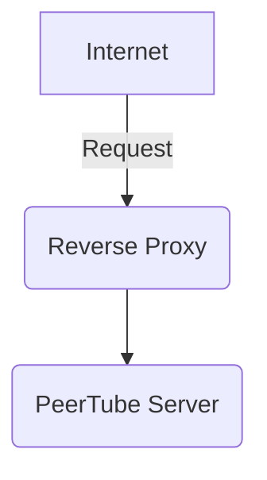

# Self Hosted PeerTube Server

This playbook allows you to self-host a PeerTube sever.

It was tested on Fedora 41.

Note: The playbook assumes that you bring your own webserver. You will need to configure a webserver either
on the machine you're installing PeerTube on or on another machine. 

My setup is as follows:

Blogs:
- https://blog.nuculabs.de/posts/2025/2025-01-25-self-hosting-peertube/
- https://docs.joinpeertube.org/install/docker

### Email

For e-mail, I use services from a mail provider on my custom domain.

You can use any service that allows you SMTP access such as Gmail (with app passwords), Fastmail (paid), ProtonMail (paid).
